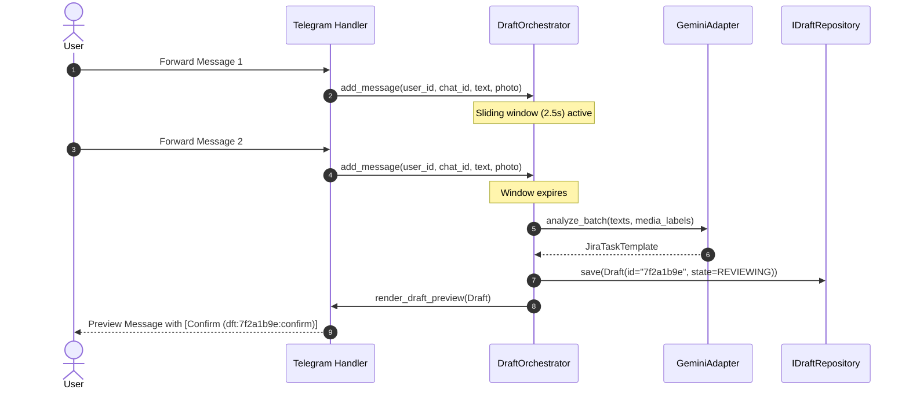
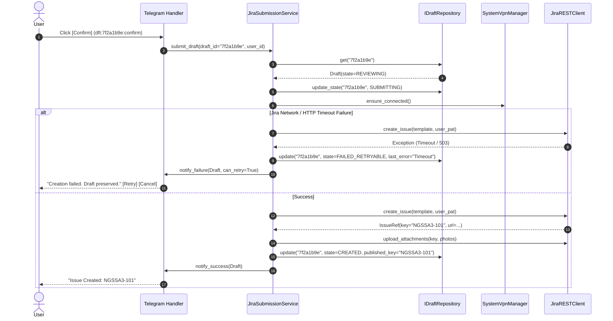

# Architecture & Structural Cleanliness Proposal: DZTGBot

**Author**: Antigravity (Software Architecture & Structural Cleanliness Lead)  
**Target Repository**: DZTGBot (`c:\Users\mikal\OneDrive\Others\DZTGBot`)  
**Reference Review**: [`docs/reviews/telegram-bot-end-to-end-review-2026-08-07.md`](file:///c:/Users/mikal/OneDrive/Others/DZTGBot/docs/reviews/telegram-bot-end-to-end-review-2026-08-07.md)  
**Date**: August 2026  

---

## 1. Architectural Executive Summary

DZTGBot is an asynchronous Telegram bot designed to convert forwarded messages into structured Jira task drafts via Gemini AI, present interactive previews for human approval, and create or update issues in a self-hosted Jira Data Center/Server instance over REST API v2.

While the current codebase establishes a functional pilot and implements commendable system-level security practices (atomic local writes, mode `0600` permissions, systemd hardening), the internal architecture suffers from **tight coupling, procedural monoliths, implicit mutable state, and race-prone concurrency**.

### Primary Refactoring Goals:
1. **Deconstruct Monolithic `core.py` (40.7 KB)** into focused, single-responsibility layers (Presentation, Application/Services, Domain, Infrastructure).
2. **Eliminate Stale-Button & Cross-Chat Collisions** by introducing unique, UUID-backed `Draft` entities with explicit owner/chat binding.
3. **Formalize Workflow Mechanics** with a Finite State Machine (FSM) replacing ad-hoc `context.user_data` dict mutation.
4. **Decouple Business & Domain Logic from Telegram API** (`Update`/`ContextTypes`) to enable true unit and integration testing.
5. **Establish Idempotent & Failure-Preserving Mutations**, ensuring drafts are never discarded prior to confirmed Jira creation.

---

## 2. Current Architecture & Structural Flaws

```
[ Current Monolithic Flow ]
Telegram Update ---> core.py (Monolith: 40.7KB)
                      ├── Inline callback routing & parsing
                      ├── Unbound context.user_data dict mutations
                      ├── Telegram HTML string formatting
                      ├── Untracked asyncio.create_task timers
                      ├── Direct call to GeminiAnalyzer (analysis.py)
                      ├── Direct call to JiraClient (jira_client.py)
                      └── Photo download & attachment loop
```

### Key Bottlenecks Identified in the Audit:

1. **Procedural Monolith (`core.py`)**:
   `core.py` handles input parsing, sliding-window batching timers, state mutations, inline UI rendering, Gemini calls, Jira REST calls, attachment management, and error handling. This prevents isolated testing and violates the Single Responsibility Principle (SRP).

2. **Implicit & Unbound State Storage**:
   Drafts are stored as raw dictionary keys (`pending_template`, `pending_photo_file_ids`, `editing_draft`, `last_published`) inside `context.user_data`. 
   - State is scoped only to a Telegram `user_id`, colliding across multiple group/private chats.
   - Callback queries carry static action strings (`jira_confirm`, `jira_edit`) without draft IDs. Buttons on older messages act on whatever latest state is currently stored in `user_data`.

3. **Leaky Layer Abstractions**:
   - `GeminiAnalyzer` in `analysis.py` returns Telegram preview strings (`render_preview_text`) and parses editable UI blocks (`parse_editable_text`), coupling AI analysis to Telegram UI formatting.
   - `JiraClient` directly depends on `NetworkManagerL2tpManager` for lazy VPN checks, mixing network infrastructure concerns with REST API client operations.
   - Business handlers accept `Update` and `ContextTypes.DEFAULT_TYPE` directly, making it impossible to exercise core business flows without mocking complex Telegram objects.

4. **Resilience & Mutation Vulnerabilities**:
   - Drafts are cleared from memory *before* dispatching the Jira HTTP request. If Jira times out or fails, the draft is lost permanently.
   - Retrying ambiguous create timeouts can cause duplicate issue creation because requests lack client-side idempotency keys or transaction state.

---

## 3. Target Layered Architecture Blueprint

The refactored design follows Clean / Layered Architecture principles, enforcing strict unidirectional dependencies:

```
+-----------------------------------------------------------------------+
|                         Presentation Layer                            |
|    dztgbot.ui (Handlers, Telegram Routers, Formatters, Keyboards)     |
+-----------------------------------------------------------------------+
                                   |
                                   v
+-----------------------------------------------------------------------+
|                         Application Layer                             |
|    dztgbot.services (DraftService, JiraService, AuthService)          |
+-----------------------------------------------------------------------+
                                   |
                                   v
+-----------------------------------------------------------------------+
|                            Domain Layer                               |
|    dztgbot.domain (Draft Entity, DraftFSM, Value Objects, Interfaces)  |
+-----------------------------------------------------------------------+
                                   ^
                                   |
+-----------------------------------------------------------------------+
|                        Infrastructure Layer                           |
|    dztgbot.infrastructure (Repositories, Gemini, Jira, VPN, Storage)   |
+-----------------------------------------------------------------------+
```

### Layer Responsibilities & Contracts:

#### A. Domain Layer (`dztgbot.domain`)
Contains pure Python domain logic, entity definitions, value objects, domain events, and state machines. **Zero external dependencies** (no `telegram`, `httpx`, or `pydantic` runtime dependencies where possible).

- **`Draft` Entity**: Aggregate root containing `draft_id` (UUID), `owner_id`, `chat_id`, `state` (`DraftState`), `template` (`JiraTaskTemplate`), `source_messages`, `attachments`, `created_at`, and `last_error`.
- **`DraftState` FSM**: Formal state transitions:
  `COLLECTING` -> `ANALYZING` -> `REVIEWING` -> `SUBMITTING` -> `CREATED` | `FAILED_RETRYABLE` | `CANCELLED`.
- **Domain Interfaces**: `IDraftRepository`, `IUserRepository`, `IRulesRepository`, `IAIAnalyzer`, `IJiraClient`, `IVpnManager`.

#### B. Application / Service Layer (`dztgbot.services`)
Orchestrates use cases and enforces application transactions.

- **`DraftOrchestrator`**: Handles forward batch collection window, triggers AI analysis, creates draft entities, applies manual edits, and manages draft state transitions.
- **`JiraSubmissionService`**: Manages pre-submission checks, VPN verification, Jira issue creation/updates, attachment uploading, idempotency locks, and retryable failure retention.
- **`AuthService`**: Enforces private-chat PAT validation, credential storage with secure file permissions, and credential removal.

#### C. Infrastructure Layer (`dztgbot.infrastructure`)
Implements domain interfaces for external APIs and persistence.

- **Repositories**: `InMemoryDraftRepository` (or `SQLiteDraftRepository`), `FileUserRepository`, `FileRulesRepository`.
- **External API Adapters**: `GeminiAdapter` (implementing `IAIAnalyzer`), `JiraRESTClient` (implementing `IJiraClient`), `SystemVpnManager` (implementing `IVpnManager`).

#### D. Presentation / UI Layer (`dztgbot.ui`)
Telegram-specific update handlers, command routers, callback parsers, and UI layout formatters.

- **`handlers/`**: Modular handler registration for Auth, Drafts, Admin, and Commands.
- **`formatters.py`**: Pure functions taking domain entities (`Draft`, `JiraTaskTemplate`) and returning HTML-formatted Telegram messages.
- **`keyboards.py`**: Pure functions returning `InlineKeyboardMarkup` or `ReplyKeyboardMarkup` with structured callback envelopes (`act:draft_id:verb`).

---

## 4. Proposed Package Structure

```
src/dztgbot/
├── __init__.py
├── __main__.py                   # Dependency Injection container & entry point
├── config.py                     # Immutable application settings & validation
├── domain/                       # Core business rules & entities
│   ├── __init__.py
│   ├── models.py                 # Draft, JiraTaskTemplate, UserProfile entities
│   ├── fsm.py                    # DraftState enum & StateTransitionGuard
│   ├── callbacks.py              # CallbackEnvelope parser (act:draft_id:verb)
│   └── interfaces.py             # Repository & Service interface definitions
├── services/                     # Application use case orchestrators
│   ├── __init__.py
│   ├── draft_service.py          # Batching, intake, preview orchestration
│   ├── jira_service.py           # Submission, retry, published issue editing
│   ├── auth_service.py           # Onboarding, PAT validation, credential store
│   └── admin_service.py          # Rules management & VPN operations
├── infrastructure/               # External clients & persistence
│   ├── __init__.py
│   ├── gemini_adapter.py         # Gemini AI API integration
│   ├── jira_adapter.py           # Jira REST API v2 integration
│   ├── vpn_adapter.py            # NetworkManager L2TP/IPsec wrapper
│   └── persistence/
│       ├── __init__.py
│       ├── draft_repository.py   # Draft storage (In-Memory / SQLite)
│       ├── user_repository.py    # Atomic mode 0600 JSON user store
│       └── rules_repository.py   # Atomic text rules store with LKG
└── ui/                           # Telegram UI & Presentation
    ├── __init__.py
    ├── formatters.py             # Telegram HTML message formatting
    ├── keyboards.py              # Inline & Reply keyboard constructors
    └── handlers/
        ├── __init__.py
        ├── auth_handlers.py      # /auth, /logout, conversation handler
        ├── draft_handlers.py     # Forwards, /new, inline callbacks
        └── admin_handlers.py     # /rules, /vpn, admin controls
```

---

## 5. Domain Models & State Machine Design

### 5.1 `Draft` Entity & Value Objects (`dztgbot/domain/models.py`)

```python
from dataclasses import dataclass, field
from datetime import datetime, timezone
from enum import Enum
from typing import List, Optional
import uuid

class DraftState(str, Enum):
    COLLECTING = "collecting"
    ANALYZING = "analyzing"
    REVIEWING = "reviewing"
    SUBMITTING = "submitting"
    CREATED = "created"
    FAILED_RETRYABLE = "failed_retryable"
    CANCELLED = "cancelled"

@dataclass
class JiraTaskTemplate:
    project_key: str
    issue_type: str
    summary: str
    description: str
    priority: str
    labels: List[str] = field(default_factory=list)
    components: List[str] = field(default_factory=list)
    assignee: str = ""
    acceptance_criteria: str = ""

@dataclass
class AttachmentRef:
    file_id: str
    media_type: str
    file_name: Optional[str] = None

@dataclass
class Draft:
    draft_id: str = field(default_factory=lambda: str(uuid.uuid4())[:8])
    owner_id: int = 0
    chat_id: int = 0
    state: DraftState = DraftState.COLLECTING
    template: Optional[JiraTaskTemplate] = None
    source_texts: List[str] = field(default_factory=list)
    attachments: List[AttachmentRef] = field(default_factory=list)
    created_at: datetime = field(default_factory=lambda: datetime.now(timezone.utc))
    updated_at: datetime = field(default_factory=lambda: datetime.now(timezone.utc))
    published_issue_key: Optional[str] = None
    published_issue_url: Optional[str] = None
    last_error: Optional[str] = None
```

### 5.2 Callback Data Envelope Pattern (`dztgbot/domain/callbacks.py`)

To eliminate stale-button bugs, every inline button callback string will follow a compact, deterministic schema limited to 64 bytes (Telegram Bot API limit):

```
Schema:  <prefix>:<draft_id>:<action>[:<extra>]
Example: dft:7f2a1b9e:confirm
Example: dft:7f2a1b9e:type_toggle
Example: dft:7f2a1b9e:prio_toggle
```

```python
@dataclass(frozen=True)
class CallbackEnvelope:
    prefix: str       # "dft" (draft), "pub" (published), "auth"
    entity_id: str    # e.g. draft_id "7f2a1b9e"
    action: str       # e.g. "confirm", "edit", "cancel"
    payload: str = "" # e.g. optional parameter

    def encode(self) -> str:
        res = f"{self.prefix}:{self.entity_id}:{self.action}"
        if self.payload:
            res += f":{self.payload}"
        return res

    @classmethod
    def decode(cls, data: str) -> "CallbackEnvelope":
        parts = data.split(":")
        if len(parts) < 3:
            raise ValueError(f"Invalid callback data: {data}")
        return cls(
            prefix=parts[0],
            entity_id=parts[1],
            action=parts[2],
            payload=":".join(parts[3:]) if len(parts) > 3 else "",
        )
```

---

## 6. Sequence Diagrams

### 6.1 Forward Intake, Batching & Draft Creation



### 6.2 Failure-Preserving Jira Creation Workflow



---

## 7. Design Patterns & Best Practices

1. **Repository Pattern (`IDraftRepository`)**:
   Decouples business logic from storage choices. Enables unit testing with an in-memory dictionary repository, while supporting seamless migration to SQLite for persistent draft recovery across service restarts.

2. **State Pattern / Finite State Machine (`DraftState`)**:
   Guards draft state transitions. For example, calling `submit_draft()` on a draft in `SUBMITTING` or `CANCELLED` state raises a `InvalidStateTransitionError`, preventing double-submission bugs.

3. **Adapter Pattern (`GeminiAdapter`, `JiraAdapter`)**:
   Wraps third-party SDKs (`google-genai`, `httpx`). Third-party exception types are caught and translated into domain exceptions (`AnalysisError`, `JiraConnectionError`, `JiraAuthError`).

4. **Factory / Dependency Injection Container (`__main__.py`)**:
   Instantiates components at startup and injects dependencies via constructors. Eliminates global singleton state.

5. **Envelope / Command Pattern (`CallbackEnvelope`)**:
   Serializes and deserializes structured callback parameters, ensuring button actions map strictly to target entities.

---

## 8. State Management & Concurrency Strategy

1. **Telegram Update Dispatching**:
   Configure PTB `ApplicationBuilder().concurrent_updates(False)` or use per-chat keyed worker queues (`concurrent_updates(True)` with explicit key isolation). This guarantees that sequential updates from the same chat/user are processed in deterministic order, avoiding state race conditions.

2. **Job Queue Integration**:
   Replace raw, unmanaged `asyncio.create_task()` calls for sliding-window batch timers with python-telegram-bot's built-in `JobQueue`. This guarantees job lifecycle tracking, graceful shutdown, and error handling.

3. **Draft Idempotency Lock**:
   When a user clicks `[Confirm]`, the `Draft` state immediately transitions from `REVIEWING` to `SUBMITTING`. Any subsequent clicks on the same button will encounter state `SUBMITTING` and be ignored, preventing concurrent duplicate requests.

---

## 9. Structural Refactoring Execution Roadmap

```
                                [ REFACTORING PHASES ]
                                
[Phase 1: Domain & Interfaces] ──> [Phase 2: Infrastructure] ──> [Phase 3: Core Services]
                                                                        │
[Phase 5: Main Wiring & Tests] <── [Phase 4: Telegram UI Layer] <───────┘
```

### Phase 1: Domain & Interfaces (`dztgbot/domain/`)
- Define `Draft`, `JiraTaskTemplate`, `AttachmentRef`, and `DraftState`.
- Implement `CallbackEnvelope` parser and encoder with unit tests.
- Define pure interfaces: `IDraftRepository`, `IUserRepository`, `IRulesRepository`, `IAIAnalyzer`, `IJiraClient`, `IVpnManager`.

### Phase 2: Infrastructure & Persistence (`dztgbot/infrastructure/`)
- Extract `user_store.py` into `FileUserRepository` implementing `IUserRepository`.
- Extract `rules.py` into `FileRulesRepository` implementing `IRulesRepository`.
- Implement `InMemoryDraftRepository` with expiration and cleanup hooks.
- Refactor `GeminiAnalyzer` to `GeminiAdapter` implementing `IAIAnalyzer` without UI dependencies.
- Refactor `JiraClient` to `JiraRESTClient` implementing `IJiraClient` without direct VPN instantiation.

### Phase 3: Application Services (`dztgbot/services/`)
- Implement `DraftOrchestrator` for message intake, sliding window batching, and draft generation.
- Implement `JiraSubmissionService` for failure-preserving Jira issue creation, updates, and photo uploads.
- Implement `AuthService` for private-chat PAT validation and session management.

### Phase 4: Telegram UI & Presentation Layer (`dztgbot/ui/`)
- Extract HTML rendering from `core.py` into pure functions in `ui/formatters.py`.
- Extract keyboard construction into pure functions in `ui/keyboards.py`.
- Create modular handler files in `ui/handlers/` (`draft_handlers.py`, `auth_handlers.py`, `admin_handlers.py`).
- Deconstruct remaining logic in `core.py`.

### Phase 5: Dependency Wiring & Integration Testing (`__main__.py`, `tests/`)
- Wire up the full application dependency graph in `__main__.py`.
- Add handler-level integration unit tests using mock infrastructure adapters.
- Validate that all 30 existing unit tests continue to pass alongside the new architecture tests.

---

## 10. Verification & Quality Acceptance Criteria

| Metric / Check | Target / Criterion |
| :--- | :--- |
| **Modular Isolation** | `core.py` replaced by modular packages (`ui/`, `services/`, `domain/`, `infrastructure/`). No single file exceeds 15 KB. |
| **Domain Decoupling** | `domain/` and `services/` have ZERO imports from `telegram` or `telegram.ext`. |
| **State Collision Protection** | 100% of inline callback queries include a unique `draft_id`. Clicking an old button yields a "Stale draft" message instead of mutating current state. |
| **Mutation Resilience** | 0 draft losses on simulated Jira network timeout. Draft remains in `FAILED_RETRYABLE` state with active `[Retry]` button. |
| **Concurrency Safety** | Concurrent callbacks for the same draft trigger idempotency protection (`SUBMITTING` lock). |
| **Test Suite Quality** | 100% pass rate on existing unit tests + new integration tests exercising full `DraftOrchestrator` & `JiraSubmissionService` workflows. |
| **Dependency Checks** | `pip check` returns 0 broken dependencies; code compiles cleanly with Python 3.12. |

---
*End of Proposal — `plan_antigravity.md`*

---

## 11. Cross-Audit Critiques & Rebuttals

This section evaluates the proposals submitted by **Codex** ([`plan_codex.md`](file:///c:/Users/mikal/OneDrive/Others/DZTGBot/plan_codex.md)) and **Grok** ([`plan_grok.md`](file:///c:/Users/mikal/OneDrive/Others/DZTGBot/plan_grok.md)), identifies technical strengths, missed requirements, and areas of over-engineering, and presents refined architectural synthesis for implementation.

---

### 11.1 Critiques of Codex Proposal (`plan_codex.md`)

#### Strengths Identified:
1. **Meticulous Edge-Case Identification**: Codex uncovered critical low-level bugs in current source code:
   - `handle_edited_text_input` appends photos to `pending_photo_file_ids` before verifying whether draft editing is active.
   - `analyze_forward` appends photo attachments before checking the 20-message batch cap (`MAX_BATCH_SIZE`).
   - `UserStore` mutates the in-memory dictionary before disk write succeeds (lacking copy-on-write atomicity).
   - `RulesStore` reads and compares the entire file on every request without caching modification timestamps/signatures.
2. **Resource Management Focus**: Excellent insistence on lifecycle-managed `httpx.AsyncClient` reuse and signature-based rules caching.

#### Technical Flaws & Over-Engineering:
1. **Excessive Server-Side Token Mapping for Callbacks**:
   Codex proposes server-side opaque token resolution (`j1:<action>:<opaque-token>`) mapping to `(draft_id, revision, owner, chat, message, action)`.
   - *Critique*: Storing server-side callback tokens introduces state management overhead and token expiration complexity for inline buttons remaining in chat history. A deterministic, stateless callback envelope (`dft:<draft_id>:<action>[:<payload>]`) as specified in [`plan_antigravity.md`](file:///c:/Users/mikal/OneDrive/Others/DZTGBot/plan_antigravity.md) fits within Telegram's 64-byte limit, requires zero server-side lookup tables, and is fully verified when loaded against the aggregate root from `IDraftRepository`.
2. **Fragile Client-Side Jira Idempotency Search**:
   Codex suggests querying Jira via JQL REST API using custom fields/properties after an ambiguous HTTP timeout.
   - *Critique*: In self-hosted Jira Data Center / Server REST API v2, Lucene indexing is asynchronous. Newly created issues may not appear in JQL search results for several seconds. Relying on immediate JQL queries after a timeout can produce false negatives and still create duplicates. Transitioning the draft to `RECONCILIATION_REQUIRED` (requiring user confirmation or controlled status check) is significantly more resilient.

---

### 11.2 Critiques of Grok Proposal (`plan_grok.md`)

#### Strengths Identified:
1. **Security & Logic Invariants Matrix**: Grok's 14 explicit logic invariants (L1–L14) establish a clear contract for state isolation, non-leaky logging, and authorization.
2. **Authentication Surface Reduction**: Strong recommendation for PAT-only auth, Auth TTL (2–5 min), and explicit user warnings on failed message deletion.

#### Technical Flaws & Unchecked Assumptions:
1. **Redundant Application-Layer Secret Encryption**:
   Grok proposes AES-GCM / Fernet field-level encryption for `user_store.json` using an environment variable key.
   - *Critique*: On a hardened Linux host, `user_store.json` is owned by the non-root bot user with mode `0600`. If an attacker gains local host read access to the file, they invariably have access to the systemd process environment containing `CREDENTIAL_ENCRYPTION_KEY`. Application-layer encryption adds dependency complexity without altering the host threat model. Moving user credentials into a protected SQLite database or OS keyring is a more meaningful structural improvement.
2. **Overly Restrictive Private-Only Draft Intake**:
   Grok suggests defaulting all mutating operations (including forward intake) to private chats only.
   - *Critique*: Restricting message intake exclusively to private chat breaks group collaboration where team members forward messages to a shared group bot. Group intake is safe as long as **chat-scoped draft isolation** and **strict actor callback authorization** (verifying `owner_id` on buttons) are enforced.

---

### 11.3 Synthesis & Refined Architectural Recommendations

Incorporating the best insights from Codex and Grok into the [`plan_antigravity.md`](file:///c:/Users/mikal/OneDrive/Others/DZTGBot/plan_antigravity.md) blueprint:

1. **Enhanced FSM States**:
   Update `DraftState` to explicitly include `RECONCILIATION_REQUIRED` alongside `FAILED_RETRYABLE`:
   `COLLECTING` → `ANALYZING` → `REVIEWING` → `SUBMITTING` → `CREATED` | `FAILED_RETRYABLE` | `RECONCILIATION_REQUIRED` | `CANCELLED`.
2. **Phase 0 Characterization Tests**:
   Add dedicated regression tests for the specific source bugs identified by Codex (photo leakage, 21st message attachment cap, copy-on-write memory mutation).
3. **Auth TTL & Fail-Closed Deletion Warnings**:
   Incorporate Grok's 3-minute Auth conversation TTL and explicit chat warnings if Telegram fails to delete secret PAT messages.
4. **Single Connection Pool**:
   Enforce a single lifecycle-managed `httpx.AsyncClient` in `infrastructure/jira_adapter.py` for all Jira REST and photo attachment requests.

```
+-----------------------------------------------------------------------------------+
|                            REFINED ARCHITECTURE MATRIX                             |
+-----------------------------------------------------------------------------------+
| Domain Layer   | Draft, JiraTaskTemplate, CallbackEnvelope, DraftFSM (Pure Python) |
| App Services   | DraftOrchestrator, JiraSubmissionService, AuthService            |
| Infrastructure | InMemory/SQLite DraftRepo, FileUserRepo, Gemini & Jira Adapters    |
| Presentation   | Modular Handlers (auth, draft, admin), Pure Formatters & Keyboards|
+-----------------------------------------------------------------------------------+
```

